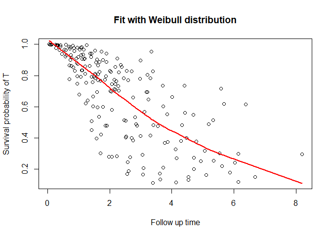

<!-- README.md is generated from README.Rmd. Please edit that file -->

# DepCens

<!-- badges: start -->
<!-- badges: end -->

The package *DepCens* uses dependent censoring regression models for
survival multivariate data. These models are based on extensions of the
frailty models, capable to accommodating the dependence between failure
and censoring times, with Weibull and piecewise exponential marginal
distributions.

## Installation

The latest stable version can be installed from CRAN:

``` r
install.packages('DepCens')
```

The latest development version can be installed from
[GitHub](https://github.com/) with:

``` r
#install.packages("devtools")
devtools::install_github('GabrielGrandemagne/DepCens')
```

## Example

This is a basic example which shows you how to solve a common problem:

``` r
library(DepCens)
#KidneyMimic is our simulated data frame
delta_t <- ifelse(KidneyMimic$cens==1,1,0)
delta_c <- ifelse(KidneyMimic$cens==2,1,0)
fit <- dependent.censoring(formula = time ~ x1 + x2 | x3 + x1, data=KidneyMimic, delta_t=delta_t,
                           delta_c=delta_c, ident=KidneyMimic$ident, dist = "weibull")
#> Warning in sqrt(diag(Var)): NaNs produzidos
#> Warning: The algorithm did not converge. It might converge if you run the
#> function again.
summary_dc(fit)
#> 
#> Weibull approach
#> 
#> Name  Estimate    Std. Error  CI INF      CI SUP      p-value     
#> Alpha    1.309432    NaN NaN NaN NaN 
#> Sigma    0.7130081   NaN NaN NaN 
#> 
#> Coefficients T:
#> 
#> Name  Estimate    Std. Error  CI INF      CI SUP      p-value     
#> x1   0.08267382  0.01759489  0.04818784  0.1171598   2.618e-06   
#> x2   -1.415567   0.245838    -1.897410   -0.9337248  8.505e-09   
#> 
#> Coefficients C:
#> 
#> Name  Estimate    Std. Error  CI INF      CI SUP      p-value     
#> x3   0.2241258   0.1811256   -0.1308803  0.5791318   0.2159  
#> x1   0.1933142   0.02558896  0.1431598   0.2434685   4.202e-14   
#> 
#> ----------------------------------------------------------------------------------
#> 
#> Information criteria:
#> 
#> AIC   BIC      HQ    
#> 403.598 433.2829 415.611
```

*KidneyMimic* is our simulated data frame. For more information check
the documentation for stored datasets.

``` r
head(KidneyMimic)
#>   ident      time event         x1 x2          x3 cens delta_t delta_c
#> 1     1 1.7828475     0  4.6770531  1  2.43961938    2       0       1
#> 2     2 6.3723589     0  0.1628727  1 -1.24630803    3       0       0
#> 3     3 6.6803247     1 -2.1962148  1 -0.73713564    1       1       0
#> 4     4 0.6975475     0  2.7430873  0 -0.31424253    2       0       1
#> 5     5 5.1130483     0 -1.1663762  1  0.03064846    2       0       1
#> 6     6 2.8189839     0  3.7558997  1 -0.52617419    2       0       1
```

You can also plot the survival function

``` r
plot_dc(fit, scenario = "t")
```


